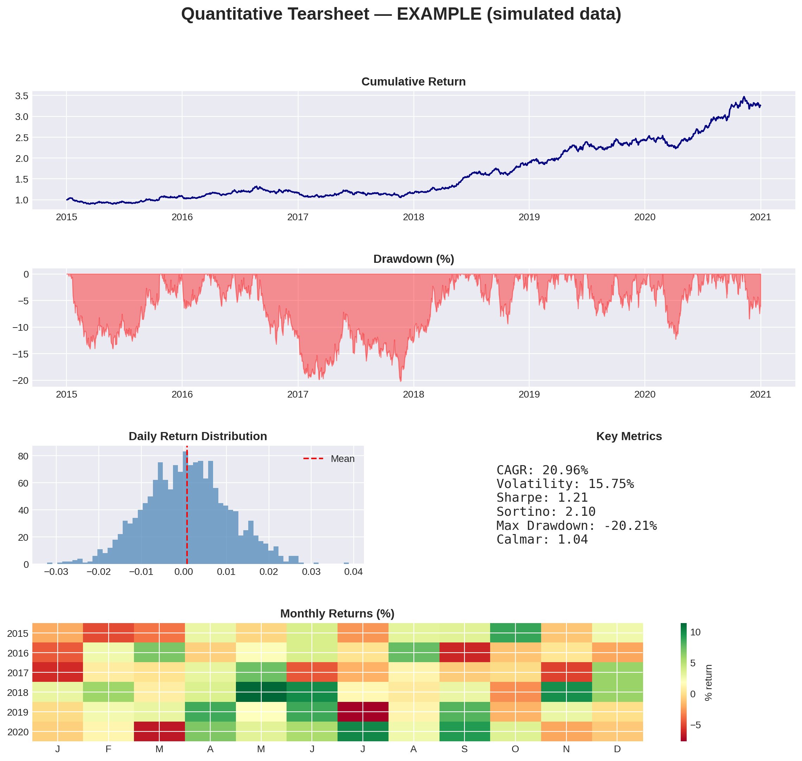

# Quantitative Tearsheet

A one-page performance and risk report ("tearsheet") built from scratch in Python — no `quantstats` or `pyfolio` shortcuts. Every metric is derived and implemented manually to demonstrate the underlying math, not just the plotting.



## Objective

A tearsheet is the standard tool a portfolio manager or risk analyst uses to evaluate a strategy or asset at a glance. It answers three questions:

1. **How much has it returned?**
2. **How much risk was taken to generate that return?**
3. **Was the risk worth it?**

This project computes and visualizes the metrics needed to answer all three, using the S&P 500 as an example (easily swapped for any ticker or custom strategy).

## What it computes

| Metric | What it measures |
|---|---|
| **CAGR** | Compound annual growth rate — the constant annual return that would produce the same final result |
| **Annualized Volatility** | Standard deviation of daily returns, scaled to a yearly figure — the most basic risk measure |
| **Sharpe Ratio** | Return earned per unit of total risk taken |
| **Sortino Ratio** | Like Sharpe, but only penalizes downside volatility (upside swings aren't "risk") |
| **Max Drawdown** | The largest peak-to-trough loss over the period — the worst-case scenario an investor would have experienced |
| **Calmar Ratio** | Annualized return divided by max drawdown — does the return justify the worst drawdown suffered? |

## Methodology notes

- **Log returns**, not simple returns, are used throughout. Log returns are additive over time (`log(P2/P1) + log(P3/P2) = log(P3/P1)`), which is why cumulative and monthly returns can be computed by summing daily returns rather than compounding multiplicatively.
- **Volatility is annualized** by multiplying the daily standard deviation by `√252` (252 trading days per year), following from the fact that variance scales linearly with time for a random walk, so standard deviation scales with its square root.
- **Drawdown** is computed by comparing the cumulative return series to its running historical maximum at every point in time — this captures not just the size but implicitly the duration of losses.

## Output

Running the script produces:
- A **cumulative return curve** (equity curve)
- An **underwater plot** (drawdown over time)
- A **histogram** of the daily return distribution
- A **monthly returns heatmap** (year × month)
- A **summary table** of all six metrics

All combined into a single exportable `tearsheet.png`.

## How to run it

```bash
pip install yfinance pandas numpy matplotlib
python tearsheet.py
```

Or open `tearsheet.py` in a Jupyter/Colab notebook and run it cell by cell.

To analyze a different asset, change the `TICKER`, `START`, and `END` constants at the bottom of the script (e.g. `TICKER = "AAPL"` or `TICKER = "BTC-USD"`).

## Possible extensions

- Compare a custom strategy (e.g. a moving-average crossover) against a benchmark on the same tearsheet
- Add a rolling Sharpe ratio subplot to see how risk-adjusted performance evolves over time
- Add a risk-free rate input for a more accurate Sharpe/Sortino calculation
- Export the tearsheet as a PDF report instead of a PNG

## Tech stack

`Python` · `pandas` · `numpy` · `matplotlib` · `yfinance`

---

*Built as part of a self-directed quantitative finance learning path, inspired by Roman Paolucci's "Projects to Help You Become a Quant" series.*
